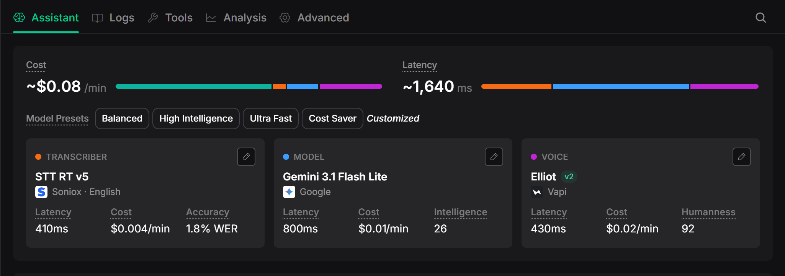
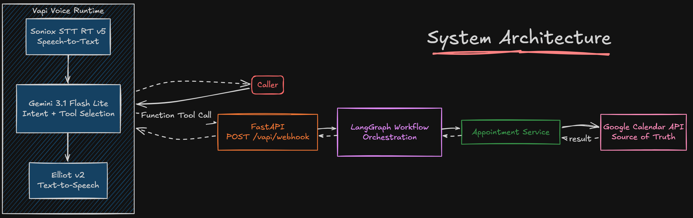
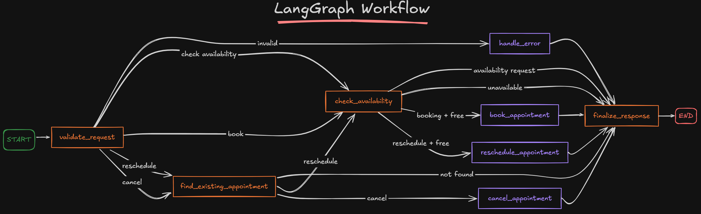

# Callendar

### [ AI Voice Appointment Agent ] 
A real-time voice scheduling agent that can **check availability, book, reschedule and cancel appointments directly in Google Calendar**.

I first built a simple version of this with n8n. I later rebuilt the orchestration in Python using FastAPI and LangGraph so I could control the workflow myself, keep the scheduling logic separate from the voice layer and actually measure what was happening inside the backend.

```text
Voice → Vapi → FastAPI → LangGraph → Google Calendar
```

**Tech Stack:** Python · FastAPI · LangGraph · Vapi · Google Calendar API · Pytest

---

## What the Agent Does

The agent is meant to feel like talking to a receptionist instead of using a form or menu.

You can say things like:

> “Can you check if Friday at 3 PM is available?”

> “Book that for me. My name is Jane.”

> “Actually, move it to 4 PM.”

> “Cancel that appointment.”

The assistant keeps the appointment context during the conversation, calls the right backend tool and only confirms an action after the backend says it actually succeeded.

### Main features

- checks real Google Calendar availability
- books 30-minute appointments
- reschedules existing appointments
- cancels appointments
- keeps appointment context during the same Vapi call
- rejects invalid or past scheduling requests
- keeps internal appointment IDs hidden from the caller
- records node-level and total backend latency
- includes 10 automated pytest tests

**4 scheduling workflows · 10 automated tests · real Google Calendar integration · latency tracking**

---

## Voice Stack

One thing I cared about with this project was making the voice interaction feel natural.

I did not want the agent to sound like a text chatbot with speech added on top. Vapi handles the real-time voice loop so the user can speak normally, get short responses and continue the same conversation while tools are being called in the background.

```text
Caller speech
    ↓
Speech-to-text
    ↓
LLM + tool selection
    ↓
Backend action
    ↓
Text-to-speech
```

My current Vapi setup is:

| Layer | Provider / Model | Dashboard Latency | Dashboard Cost | Quality Metric |
|---|---|---:|---:|---:|
| Speech-to-Text | Soniox STT RT v5 | ~410 ms | $0.004/min | 1.8% WER |
| LLM | Gemini 3.1 Flash Lite | ~800 ms | $0.01/min | Intelligence 26 |
| Text-to-Speech | Vapi Elliot v2 | ~430 ms | $0.02/min | Humanness 92 |
| **Configured voice stack** | **Vapi runtime** | **~1,640 ms** | **~$0.08/min** | — |

The full Vapi estimate is higher than the individual STT, LLM and TTS costs combined because the platform-level runtime can add its own cost.

### Rough call cost

Using the current Vapi estimate of **~$0.08/min**:

| Call Length | Estimated Cost |
|---:|---:|
| 1 minute | ~$0.08 |
| 3 minutes | ~$0.24 |
| 5 minutes | ~$0.40 |
| 10 minutes | ~$0.80 |

These are just estimates for my current configuration and can change if the Vapi model setup or pricing changes.

### Vapi Runtime Profile



*Current Vapi setup showing the selected STT, LLM, voice, latency and cost.*

---

## Architecture



Each part has a pretty specific job:

| Layer | What it does |
|---|---|
| **Vapi** | handles the live conversation, transcription, model response, tool selection and voice output |
| **FastAPI** | receives Vapi tool calls and passes clean data into LangGraph |
| **LangGraph** | validates requests, stores workflow state and decides which node runs next |
| **Appointment Service** | contains the Google Calendar operations |
| **Google Calendar** | stores the actual appointments and availability |

The important part is that Vapi handles the conversation while LangGraph handles the scheduling workflow.

I do not send the full transcript into LangGraph. Vapi already gives the backend structured tool arguments, so the graph can focus on deterministic scheduling logic.

---

## LangGraph Workflow

The backend supports four actions:

```text
check_availability
book_appointment
reschedule_appointment
cancel_appointment
```

The graph routes them like this:


### Shared state

The graph uses a small `AppointmentState` object:

```python
class AppointmentState(TypedDict, total=False):
    action: str
    caller_name: str
    appointment_id: str
    requested_start: str

    status: str
    result_message: str
    error: str | None

    node_timings_ms: dict[str, float]
```

For example, a booking can enter the graph as:

```json
{
  "action": "book_appointment",
  "caller_name": "Jane",
  "requested_start": "2026-09-18T15:00:00-04:00"
}
```

and finish with:

```json
{
  "action": "book_appointment",
  "caller_name": "Jane",
  "requested_start": "2026-09-18T15:00:00-04:00",
  "status": "success",
  "appointment_id": "google-event-id",
  "result_message": "Appointment booked successfully..."
}
```

### Call memory

Vapi's `call.id` is used as the LangGraph `thread_id`.

```text
Vapi call.id → LangGraph thread_id
```

That lets the graph keep checkpoints tied to the same live call.

After booking, the Google Calendar event ID is returned in the tool result. Vapi can reuse that ID later in the same conversation for rescheduling or cancellation without ever asking the caller to say it out loud.

---

## Example Request Flow

If the user says:

> “Book September 18th at 3 PM. My name is Jane.”

the full path is:

```text
1. Caller speaks
2. Soniox transcribes the speech
3. Gemini decides that book_appointment should be called
4. Vapi sends the tool call to FastAPI
5. FastAPI converts the tool arguments into AppointmentState
6. LangGraph validates the request
7. LangGraph checks Google Calendar availability
8. The graph routes to the booking node
9. Google Calendar creates the event
10. LangGraph returns the final result
11. FastAPI sends the tool result back to Vapi
12. Elliot v2 speaks the confirmation
```

The Vapi prompt also tells the assistant not to claim that something was booked, moved or cancelled until the backend reports success.

---

## Google Calendar Integration

The appointment service talks directly to Google Calendar.

| Scheduling Action | Google Calendar Operation |
|---|---|
| Check availability | FreeBusy API |
| Create appointment | `events.insert` |
| Find appointment | `events.get` |
| Reschedule appointment | `events.update` |
| Cancel appointment | `events.delete` |

The Google Calendar event ID is also used as the internal appointment ID, so I did not need a second database just to track appointments.

Before creating a booking, the service checks availability again so it does not blindly create an event if the slot became occupied after the first check.

---

## Latency Tracking

I added timing around every LangGraph node and around the full FastAPI request.

A booking log looks like:

```text
call_id=... action=book_appointment node=validate status=validated latency_ms=0.02
call_id=... action=book_appointment node=check_availability status=available latency_ms=541.82
call_id=... action=book_appointment node=book status=success latency_ms=988.63
call_id=... action=book_appointment node=finalize status=success latency_ms=0.00
call_id=... action=book_appointment status=success total_backend_ms=1544.25
```

### Measured backend latency

These numbers came from real local runs against Google Calendar.

#### Availability request

| Stage | Measured Time |
|---|---:|
| Validation | ~0.01 ms |
| Calendar availability node | ~357 ms |
| Finalize | ~0 ms |
| **Total backend** | **~392 ms** |

#### Booking request

| Stage | Measured Time |
|---|---:|
| Validation | ~0.02 ms |
| Calendar availability node | ~542 ms |
| Booking node | ~989 ms |
| Finalize | ~0 ms |
| **Total backend** | **~1,544 ms** |

From these runs, the LangGraph routing itself is basically negligible compared with the time spent waiting on Google Calendar.

This is separate from Vapi's ~1,640 ms voice stack estimate, which is for the STT, model and TTS side of the conversation.

---

## Validation

Before anything touches Google Calendar, the backend checks the request.

It handles:

- missing booking name
- missing appointment time
- missing appointment ID
- malformed datetime values
- datetimes without a timezone
- appointment times in the past
- unknown tool names
- occupied time slots
- missing calendar events
- repeated cancellation attempts

The Vapi assistant also gets the current date and time in its system prompt so dates like “Friday” or “September 18” are resolved against the current year instead of the model guessing.

---

## Run It Yourself

### Requirements

- Python 3.10+
- Git
- a Google account
- a Google Cloud project
- a Vapi account
- ngrok

### 1. Clone the repository

```bash
git clone https://github.com/YOUR_USERNAME/YOUR_REPOSITORY.git
cd YOUR_REPOSITORY
```

### 2. Create a virtual environment

#### Windows PowerShell

```powershell
python -m venv .venv
.venv\Scripts\Activate.ps1
```

#### macOS / Linux

```bash
python3 -m venv .venv
source .venv/bin/activate
```

### 3. Install dependencies

```bash
python -m pip install --upgrade pip
python -m pip install -r requirements.txt
```

### 4. Set up Google Calendar

1. Open Google Cloud Console.
2. Create or select a project.
3. Enable the **Google Calendar API**.
4. Open **Google Auth Platform**.
5. Create an OAuth client for a **Desktop app**.
6. Download the credentials file.
7. Rename it to:

```text
credentials.json
```

8. Put it in the project root.
9. If the OAuth app is still in testing mode, add your Google account under **Test users**.

The first successful login creates:

```text
token.json
```

Both files should stay local and are excluded from Git.

### 5. Start FastAPI

```bash
uvicorn app.main:app --reload --port 8000
```

Health check:

```text
http://127.0.0.1:8000/health
```

Expected response:

```json
{
  "status": "ok"
}
```

### 6. Start ngrok

In another terminal:

```bash
ngrok http 8000
```

Copy the HTTPS URL:

```text
https://example.ngrok-free.app
```

Your Vapi webhook becomes:

```text
https://example.ngrok-free.app/vapi/webhook
```

### 7. Create the Vapi tools

Create these four function tools.

#### `check_availability`

```text
requested_start: string
```

#### `book_appointment`

```text
caller_name: string
requested_start: string
```

#### `reschedule_appointment`

```text
appointment_id: string
requested_start: string
```

#### `cancel_appointment`

```text
appointment_id: string
```

Point all four tools to:

```text
https://YOUR-NGROK-URL/vapi/webhook
```

All appointment times should be sent as ISO 8601 values with a timezone offset.

Example:

```text
2026-09-18T15:00:00-04:00
```

### 8. Configure the Vapi assistant

The assistant should:

- help with availability, booking, rescheduling and cancellation
- collect the caller's name before booking
- assume 30-minute appointments
- send timezone-aware ISO 8601 times to tools
- use the current date when a year is not provided
- reuse the appointment ID returned by a previous tool result
- never ask the caller to read an appointment ID
- only confirm an action after the backend reports success
- keep spoken responses short and natural

My current setup uses:

```text
STT:   Soniox STT RT v5
LLM:   Gemini 3.1 Flash Lite
Voice: Elliot v2
```

### 9. Start talking

Open the assistant in Vapi and press **Talk**.

Try:

> “Is tomorrow at 3 PM available?”

Then:

> “Book it for me. My name is Jane.”

Then:

> “Actually, move that to 4 PM.”

Then:

> “Cancel it.”

The same conversation should go through all four workflow types while keeping the internal appointment ID hidden.

---

## Testing

The project currently has **10 passing pytest tests**.

The tests cover:

- valid booking validation
- missing booking information
- unknown actions
- available slots
- unavailable slots
- successful booking
- appointment-not-found handling
- successful cancellation
- LangGraph booking routing
- Vapi webhook handling
- latency data produced by graph execution

Google Calendar calls are replaced with predictable fake results during automated tests using pytest's `monkeypatch`. That means the tests do not create or delete real calendar events.

Run the test suite with:

```bash
pytest -v
```

Example result:

```text
10 passed
```

### Test Result

<details>
<summary>View pytest result</summary>


*Automated test suite passing.*

</details>

---

## Repository Structure

```text
.
├── app/
│   ├── main.py
│   │
│   ├── graph/
│   │   ├── state.py
│   │   ├── nodes.py
│   │   └── workflow.py
│   │
│   └── services/
│       └── appointment_service.py
│
├── tests/
│   ├── test_nodes.py
│   ├── test_graph.py
│   └── test_webhook.py
│
├── experiments/
│   ├── try_google_calendar.py
│   ├── try_booking_flow.py
│   ├── try_langgraph.py
│   └── try_appointment_service.py
│
├── .gitignore
├── requirements.txt
└── README.md
```

The `experiments/` folder contains the small manual scripts I used while checking the Google Calendar and LangGraph pieces separately during development.

---

## Build Order

I built the project in layers so I could test one part at a time instead of debugging the full voice stack all at once.

```text
FastAPI connectivity
        ↓
Google Calendar operations
        ↓
LangGraph state + routing
        ↓
Vapi tool calling
        ↓
End-to-end voice workflow
        ↓
Latency tracking
        ↓
Automated tests
```

That made it easier to tell whether a problem was coming from Vapi, FastAPI, LangGraph or Google Calendar.

The final setup keeps those responsibilities separate: Vapi handles the live conversation, LangGraph controls the workflow and Google Calendar stays as the source of truth for appointments.
